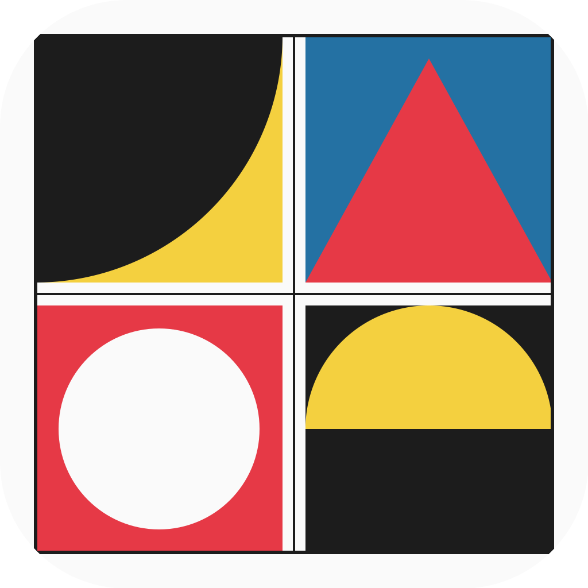

<p align="center">
  
</p>

<h1 align="center">BlockHaus</h1>

<p align="center">A Bauhaus-inspired pattern composer — select tiles, create repeating compositions.</p>

<p align="center">
  
  
  
</p>

---

Inspired by classic Bauhaus geometric forms. Pick tiles from a randomized strip, and watch them fill a canvas in a repeating pattern. Customize grid size, color palettes, and geometric forms.

## Features

- **20 geometric tile patterns** — circles, half-circles, quarter-circles, triangles, stripes, dots, crosses, nested squares, and more
- **Tile strip** — horizontal scrollable row of randomized tiles
- **Tap to select** tiles (numbered in selection order)
- **Pattern grid** — displays your selected tiles in a repeating composition; tap to shuffle the order
- **Settings** — customize grid size (2x2, 3x3, 4x4), color palette, number of colors, and geometric forms
- **5 color palettes** — Bauhaus, Fluorescent, Pastel, Monochrome, Earth
- **Share** — export your composition as a PNG image
- **Shake** your device to regenerate
- **Adaptive layout** — strip and canvas reflow on rotation and iPad

## Requirements

- iOS 17+
- Xcode 15.4+

## Getting Started

```bash
git clone https://github.com/daviferreira/BlockHaus.git
open BlockHaus/BlockHaus.xcodeproj
```

Build and run on any iPhone or iPad simulator.

## Architecture

Minimal — 11 Swift files, no external dependencies.

```
BlockHaus/
├── BlockHausApp.swift
├── Models/
│   ├── TilePattern.swift          # 20 pattern cases + categories
│   ├── TileModel.swift            # Tile state
│   ├── GridModel.swift            # @Observable model + selection logic
│   └── SettingsModel.swift        # Grid size, palettes, pattern toggles
├── Views/
│   ├── ContentView.swift          # Root + toolbar + shake detection
│   ├── TileStripView.swift        # Horizontal scrollable tile selector
│   ├── PatternCanvasView.swift    # Canvas-based repeating pattern grid
│   ├── TileView.swift             # Canvas-based tile rendering
│   ├── TilePatternRenderer.swift  # All 20 pattern draw functions
│   └── SettingsView.swift         # Settings form (grid, palette, forms)
└── Theme/
    └── BauhausColors.swift        # Color palette definitions
```

## License

MIT
